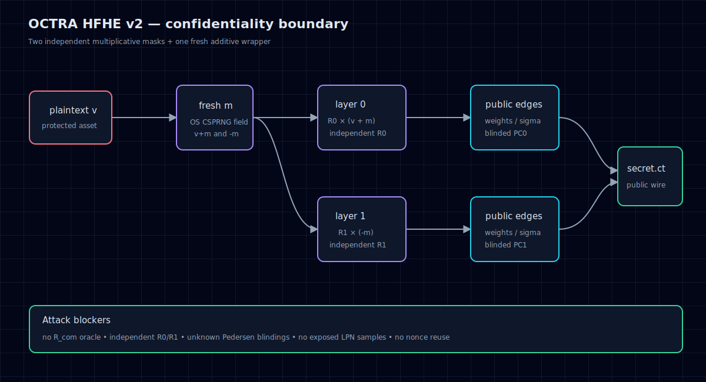

# Threat model



## Protected asset

The plaintext embedded in `secret.ct`, including wallet credentials and claim instructions.

## Attacker capabilities

- Reads all challenge files and public source/history
- Performs unlimited offline computation within practical resource limits
- Knows the target OCTRA address and likely plaintext format
- Can compile modified implementations and create controlled ciphertexts
- Cannot access the challenge generator's process memory, secret key, OS RNG state, or non-public systems

## Public flow

```mermaid
flowchart LR
    V[Plaintext v] --> A[Add fresh mask m]
    M[Fresh m] --> A
    A --> L0[Layer 0: R0 × (v + m)]
    M --> N[Negate m]
    N --> L1[Layer 1: R1 × (-m)]
    R0[Independent secret R0] --> L0
    R1[Independent secret R1] --> L1
    L0 --> E0[Public edge decomposition]
    L1 --> E1[Public edge decomposition]
    R0 --> P0[Blinded commitment PC0]
    R1 --> P1[Blinded commitment PC1]
    E0 --> C[secret.ct]
    E1 --> C
    P0 --> C
    P1 --> C
```

## Why tested attacks failed

| Attempt | Missing ingredient |
|---|---|
| Guess plaintext and verify | No public mask-opening oracle |
| Cancel wrapper layers | `R0` and `R1` are independent |
| Recover LPN secret | Explicit `(A, y)` samples are not exposed |
| Use commitments | Pedersen blindings remain unknown |
| Reuse historical artifacts | Keys, nonces, and canonical tags differ |
| Detect zero publicly | Wrapped zero has nonzero public aggregates |
| Brute-force wallet | 128 unbiased entropy bits remain infeasible |

## Trust boundaries

- **Generator boundary:** key generation and OS CSPRNG must be correct.
- **Wire boundary:** serializers must omit candidate-checkable secret commitments.
- **Proof boundary:** native-reset/proof objects must not be confused with ordinary ciphertext confidentiality.
- **Client boundary:** recovered credentials, if ever obtained, must never be logged or published.
